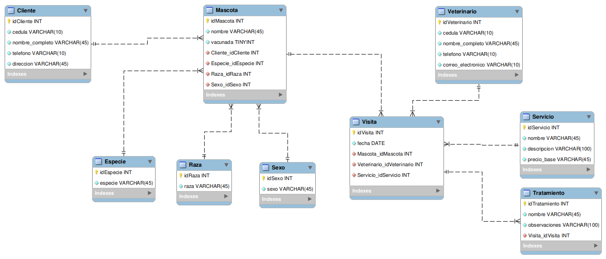
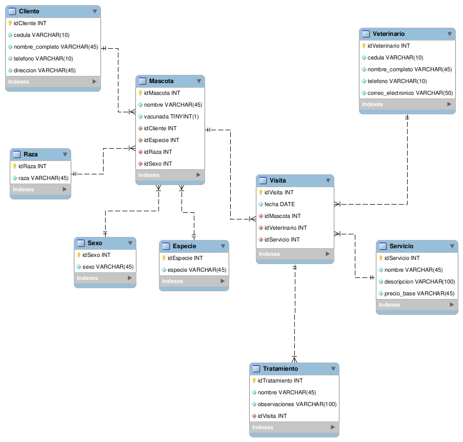

# 🐾 Base de Datos — Veterinaria *"Mi Mejor Amigo"*

Modelo relacional en **MySQL** para gestionar la operación diaria de una veterinaria: dueños, mascotas, veterinarios, servicios, visitas y tratamientos, todo centralizado en una sola base de datos.

---

## 🩺 ¿Para qué sirve esta base de datos?

### El problema

Una veterinaria que lleva su información en papel, hojas de Excel sueltas o en la memoria del personal tarde o temprano se enfrenta a las mismas dificultades: no hay forma confiable de saber qué mascotas ya fueron vacunadas, qué veterinario atendió a cuál paciente, cuándo fue la última visita de un animal, o cuánto se le cobró a un cliente por un servicio. La información queda dispersa, duplicada o simplemente se pierde, lo que dificulta dar un buen seguimiento clínico y administrativo a cada mascota y a cada cliente.

### La solución

Esta base de datos centraliza toda esa información en un modelo relacional ordenado: cada dueño, mascota, veterinario, servicio, visita y tratamiento queda registrado una sola vez y conectado correctamente con el resto de los datos mediante llaves primarias y foráneas. Esto elimina la duplicidad, mantiene la consistencia (por ejemplo, evita cédulas o correos repetidos) y permite reconstruir el historial completo de cualquier mascota con una simple consulta SQL.

### ¿Qué permite hacer?

| Funcionalidad | Descripción |
|---|---|
| 🧑‍🤝‍🧑 Registro de clientes | Guarda cédula, nombre, teléfono y dirección de cada dueño. |
| 🐶 Registro de mascotas | Asocia cada mascota a su dueño, especie, raza y sexo, e indica si está vacunada. |
| 👩‍⚕️ Registro de veterinarios | Almacena los datos de contacto del personal médico que atiende. |
| 🧾 Catálogo de servicios | Define los servicios ofrecidos (baño, consulta, vacunación, etc.) con su precio base. |
| 📅 Registro de visitas | Une mascota + veterinario + servicio + fecha en un solo evento clínico. |
| 💊 Historial de tratamientos | Detalla observaciones médicas específicas de cada visita. |
| 📊 Consultas de análisis | Permite responder preguntas como "¿cuántas mascotas hay por especie?" o "¿qué mascotas están vacunadas?". |

---

## 🧱 Estructura general

Las tablas se agrupan en dos bloques temáticos, tal como se definieron en el propio script y en el diagrama de diseño (**Datos Externos** = todo lo relacionado al cliente y su mascota; **Datos Internos** = todo lo que gestiona la veterinaria puertas adentro):

| Bloque | Tablas | Propósito |
|---|---|---|
| 🟢 **Datos externos** (clientes y mascotas) | `Cliente` | Información de contacto del dueño de la mascota. |
| | `Especie` | Catálogo de especies (perro, gato, conejo, hámster...). |
| | `Raza` | Catálogo de razas disponibles para asignar a una mascota. |
| | `Sexo` | Catálogo de sexos posibles (macho / hembra). |
| | `Mascota` | Ficha de cada mascota: nombre, estado de vacunación y relación con su dueño, especie, raza y sexo. |
| 🟡 **Datos internos** (operación clínica) | `Veterinario` | Información de contacto y credenciales del personal médico. |
| | `Servicio` | Catálogo de servicios ofrecidos y su precio base. |
| | `Visita` | Evento clínico: qué mascota fue atendida, por qué veterinario, con qué servicio y en qué fecha. |
| | `Tratamiento` | Detalle médico (observaciones) asociado a una visita puntual. |

---

## 🛠️ Notas de diseño

- **Llaves primarias autoincrementales (`INT AUTO_INCREMENT`)**: todas las tablas usan un identificador numérico artificial (`idCliente`, `idMascota`, etc.) en vez de usar datos reales como llave primaria, lo que evita problemas si un dato real (como una cédula) cambiara de formato.

- **`cedula VARCHAR(10)`**: el campo se dimensionó a 10 caracteres porque coincide con el estándar colombiano de identificación vigente. Según la Registraduría Nacional del Estado Civil, desde el año 2000 se adoptó el Número Único de Identificación Personal (NUIP), un identificador de diez dígitos que acompaña a cada colombiano desde su nacimiento hasta su muerte ([fuente oficial](https://www.registraduria.gov.co/Se-cumplieron-70-anos-de-la-expedicion-de-la-primera-cedula-de-ciudadania.html)). Por eso `VARCHAR(10)` cubre tanto cédulas antiguas (8 dígitos) como el NUIP actual (10 dígitos), y se guarda como texto para no perder ceros a la izquierda ni permitir operaciones aritméticas sobre el documento.

- **Restricciones `UNIQUE`**: se aplicaron sobre `cedula` (Cliente y Veterinario), `correo_electronico` (Veterinario) y `sexo` (catálogo Sexo) para impedir registros duplicados de una misma persona o de un mismo valor de catálogo.

- **`vacunada` como booleano (`BOOLEAN` / `TINYINT(1)`)**: MySQL implementa `BOOLEAN` internamente como `TINYINT(1)`; por eso el [diagrama generado por ingeniería inversa](#️-diagramas-uml--er) lo muestra así, aunque en la práctica se comporta como un verdadero/falso.

- **Eliminación de `NOT NULL` redundante en las llaves primarias**: en el historial del proyecto se removió explícitamente el `NOT NULL` de los campos `ID`, ya que toda `PRIMARY KEY` implica `NOT NULL` de forma automática en MySQL — mantenerlo era una restricción duplicada.

- **Relaciones resueltas sin tablas intermedias**: todas las relaciones del modelo son de **1 a muchos**, así que se resolvieron directamente con una llave foránea en la tabla del lado "muchos" (por ejemplo, `Mascota.idCliente → Cliente.idCliente`). No existen relaciones muchos a muchos en este modelo, por lo que no fue necesaria ninguna tabla puente.

- **`precio_base VARCHAR(45)` en `Servicio`**: el precio se guarda como texto (por ejemplo `'45.000'`) en vez de un tipo numérico como `DECIMAL`. Es una decisión a tener en cuenta porque obliga a hacer conversiones explícitas al calcular promedios o sumas, tal como se ve en `consultas.sql` (`CAST(S.precio_base AS DECIMAL(10,2))`). Si el proyecto evoluciona, sería más robusto migrar este campo a `DECIMAL(10,2)`.

- **`observaciones VARCHAR(300)` en `Tratamiento`**: el tamaño de este campo se amplió durante el desarrollo del proyecto (según el historial de cambios) para poder registrar notas clínicas más detalladas sin truncar la información.

---

## 🗺️ Diagramas UML / ER

El proyecto incluye **dos** diagramas, que corresponden a dos momentos distintos del modelado: uno es el plano de diseño hecho antes de escribir el SQL, y el otro es la "radiografía" real de la base de datos ya creada en el motor.

**1. Diagrama de diseño inicial**



Es el diagrama dibujado **antes** de crear la base de datos. Agrupa las tablas por color para diferenciar visualmente los **Datos Externos** (verde: `Cliente`, `Mascota` y sus catálogos) de los **Datos Internos** (amarillo: `Veterinario`, `Servicio`, `Visita`, `Tratamiento`), tal como se explica en la sección [🧱 Estructura general](#-estructura-general).

**2. Diagrama generado con Reverse Engineer**



Es el diagrama que **MySQL Workbench genera automáticamente** al leer la base de datos ya creada por `estructura.sql` (función *Reverse Engineer*). Sirve para confirmar que lo que realmente quedó creado en el motor coincide con el diseño planeado; por eso no lleva agrupación por color, solo las tablas y relaciones tal cual existen en la base de datos.

> 🗂️ Cada uno de estos diagramas tiene su propio archivo editable de MySQL Workbench (`.mwb`). Más detalles en [Archivos de modelado](#️-archivos-de-modelado-mwb).

---

## 📂 Estructura del proyecto

```
BaseDatos_Veterinaria_Mi_mejor_amigo/
├── README.md
├── .gitignore
├── assets/
│   └── imgs/
│       ├── Diagrama_UML_ER.png
│       └── Reverse_Egineer_Diagrama.png
└── database/
    ├── diagrams/
    │   ├── diagrama_ER_UML.mwb
    │   └── Reverse_Egineer_Diagrama.mwb
    └── scripts/
        ├── estructura.sql
        ├── datos.sql
        └── consultas.sql
```

Archivos importantes:

- 📄 [`database/scripts/estructura.sql`](./database/scripts/estructura.sql) — creación de la base de datos y las tablas (DDL).
- 📄 [`database/scripts/datos.sql`](./database/scripts/datos.sql) — inserción de datos de ejemplo (DML).
- 📄 [`database/scripts/consultas.sql`](./database/scripts/consultas.sql) — consultas de ejemplo (DQL).
- 🗂️ [`database/diagrams/diagrama_ER_UML.mwb`](./database/diagrams/diagrama_ER_UML.mwb) — modelo editable de MySQL Workbench (diseño inicial).
- 🗂️ [`database/diagrams/Reverse_Egineer_Diagrama.mwb`](./database/diagrams/Reverse_Egineer_Diagrama.mwb) — modelo editable generado por ingeniería inversa.

---

## ▶️ Cómo usar la base de datos

### Requisitos

| Herramienta | Uso |
|---|---|
| **MySQL Server** (o MariaDB compatible) | Motor de base de datos donde se ejecutarán los scripts. |
| **MySQL Workbench** | Cliente visual recomendado para ejecutar el SQL y abrir los diagramas `.mwb`. |

### Pasos para ejecutar los scripts

1. Abre **MySQL Workbench** y conéctate a tu servidor MySQL.
2. Abre una nueva pestaña de consulta (SQL Editor).
3. Copia y pega el contenido de **`estructura.sql`** y ejecútalo completo. Esto crea la base de datos `Veterinaria_Mi_mejor_amigo` y todas sus tablas.

```sql
CREATE DATABASE IF NOT EXISTS Veterinaria_Mi_mejor_amigo;
USE Veterinaria_Mi_mejor_amigo;
-- ... resto de las tablas
```

4. Copia y pega el contenido de **`datos.sql`** y ejecútalo para poblar las tablas.
5. Copia y pega el contenido de **`consultas.sql`** para probar las consultas de ejemplo.

> ⚠️ Ejecuta los scripts **en ese orden** (`estructura.sql` → `datos.sql` → `consultas.sql`), ya que cada uno depende de que el anterior haya sido ejecutado correctamente.

### 🧪 Sobre `datos.sql`: datos ficticios, no reales

El script `datos.sql` incluye registros de **clientes, mascotas, veterinarios, servicios, visitas y tratamientos** que son completamente **ficticios**. Nombres, cédulas, teléfonos y direcciones fueron inventados únicamente con fines de prueba, para poder verificar que las tablas, las llaves foráneas y las relaciones del modelo funcionan correctamente. **No representan información real de ninguna veterinaria ni de ninguna persona.**

### 🔎 Sobre `consultas.sql`: exploración rápida de los datos

El script `consultas.sql` no modifica la base de datos; contiene una serie de consultas `SELECT` (y una tabla derivada) pensadas para **visualizar rápidamente** lo que ya quedó cargado: cuántas mascotas hay por especie, qué mascotas están vacunadas, quién atendió a quién, el historial de visitas completo, promedios de precios, entre otras. Es el punto de partida ideal para comprobar que todo el modelo quedó bien armado.

---

## 🔗 Relaciones clave del modelo

| Entidad A | Relación | Entidad B | Tipo |
|---|---|---|---|
| `Cliente` | es dueño de | `Mascota` | 1 a muchos |
| `Especie` | clasifica a | `Mascota` | 1 a muchos |
| `Raza` | clasifica a | `Mascota` | 1 a muchos |
| `Sexo` | clasifica a | `Mascota` | 1 a muchos |
| `Mascota` | es atendida en | `Visita` | 1 a muchos |
| `Veterinario` | atiende | `Visita` | 1 a muchos |
| `Servicio` | se presta en | `Visita` | 1 a muchos |
| `Visita` | genera | `Tratamiento` | 1 a muchos |

---

## 🗂️ Archivos de modelado (`.mwb`)

El proyecto incluye dos modelos de **MySQL Workbench**, uno por cada diagrama mostrado arriba:

| Archivo | Qué es | Cuándo se generó |
|---|---|---|
| [`diagrama_ER_UML.mwb`](./database/diagrams/diagrama_ER_UML.mwb) | Modelo **editable** del diseño inicial (el diagrama a color). Se puede abrir y seguir modificando en Workbench antes de tocar la base de datos real. | Al inicio del proyecto, como plano de trabajo. |
| [`Reverse_Egineer_Diagrama.mwb`](./database/diagrams/Reverse_Egineer_Diagrama.mwb) | Modelo **editable** generado con la función *Reverse Engineer*, leyendo directamente la base de datos ya creada por `estructura.sql`. | Después de ejecutar `estructura.sql`, como verificación. |


---

## 👨 Autor

Programador Full-Stack Jr. Alan Gómez

- GitHub: [AlanGomez-Programmer](https://github.com/AlanGomez-Programmer)
- LinkedIn: alan-gomez-763163320